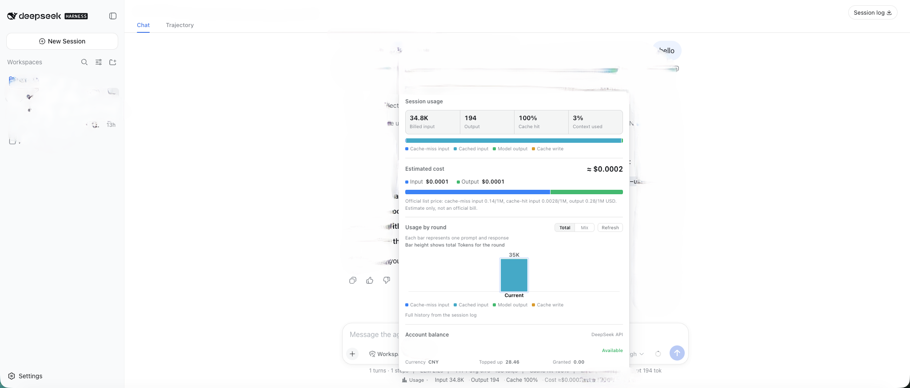
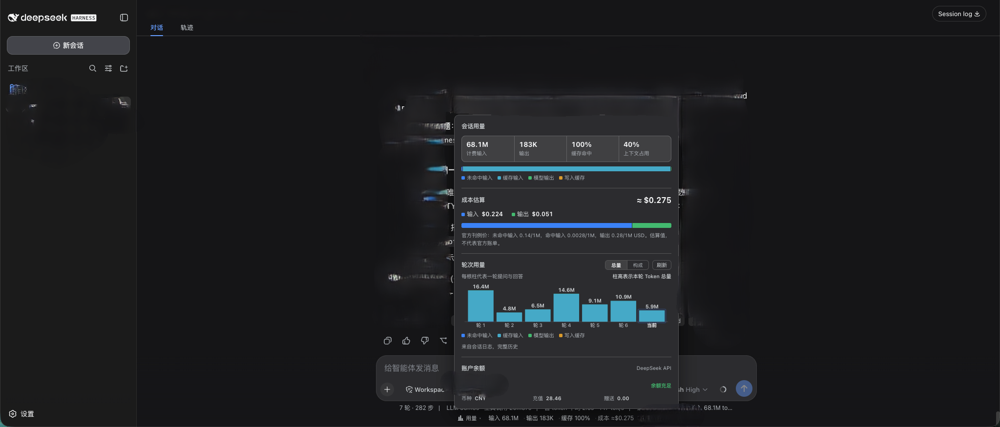

# dsh-usage-chart

> A usage, cost, and account-balance dashboard for DeepSeek Harness Web.

[中文](./README.md) · [Report an issue](https://github.com/Max-Samson/dsh-usage-chart/issues)

Interface preview: light English on the left and dark Simplified Chinese on the right.
Both variants follow the DSH theme and in-app language setting.

<table>
  <tr>
    <td width="50%"><br /><sub>Light theme · English</sub></td>
    <td width="50%"><br /><sub>Dark theme · 简体中文</sub></td>
  </tr>
</table>

> Both screenshots use fictional demo data only. They contain no real session content,
> token counts, costs, balances, or API keys.

The plugin adds a compact indicator below the conversation composer. It shows input/output tokens, cache-hit ratio, estimated cost, active model, and DeepSeek account balance. Click it to open a zero-dependency SVG dashboard with per-turn usage history.

The interface supports Chinese and English and follows the DSH in-app language setting. Browser language seeds the initial display only when the Host has not exposed a setting yet. Language changes are applied without reloading the plugin.

## Install

Requires [DeepSeek Harness](https://github.com/deepseek-ai/deepseek-harness) ≥ 0.1.0-rc.6,
Node.js ≥ 20, and [pnpm](https://pnpm.io/install) on PATH (`dsh plugin` forwards installs to pnpm).

### Option 1: npm registry (recommended, prebuilt)

```sh
dsh plugin --profile web add dsh-usage-chart
dsh web --profile web
```

Re-run the same `add` to update, then restart DSH Web.

### Option 2: install from GitHub (source build)

```sh
dsh plugin --profile web add github:Max-Samson/dsh-usage-chart#<commit-sha>
```

Git installs run the package `prepare` script (`node build.mjs`) to build from source.
pnpm ≥ 10 blocks `prepare` scripts by default — allow this package once in the profile's
`pnpm-workspace.yaml`, then re-run:

```yaml
allowBuilds:
  dsh-usage-chart: true
```

> Allowing a build script lets that package execute code on your machine during install.
> Only do this for sources you trust, and pin the commit (`#<sha>`).

### Option 3: local directory (development)

```sh
git clone https://github.com/Max-Samson/dsh-usage-chart.git
cd dsh-usage-chart
npm ci && npm run build
dsh plugin --profile web add "$PWD"   # links the current checkout
dsh web --profile web
```

### Verify the install

1. The composed profile should contain the plugin row:

   ```sh
   dsh --profile web --dump-config | grep -A4 'id: dsh-usage-chart'
   ```

2. Open DSH Web and enter any existing session: the "Usage" indicator (tokens / cost / model)
   appears below the composer, with the account balance on the right; click ▸ to open the dashboard.

Set `DEEPSEEK_API_KEY` before starting DSH Web to enable the balance query. The key stays in the Host process and is never sent to the browser.

```sh
export DEEPSEEK_API_KEY=sk-...
dsh web --profile web
```

## Data sources

| Value | Source | Notes |
|---|---|---|
| Token usage | DSH `tokenUsage` / `contextPressure` projections | Session-scoped, updated by the adapter |
| Per-turn history | DSH Host session event log | Falls back to page-observed deltas when unavailable |
| Cost | Published DeepSeek price × reported usage | Estimate, not an invoice |
| Balance | DeepSeek `GET /user/balance` | Proxied by the Host with `no-store` responses |

## Development

```sh
git clone https://github.com/Max-Samson/dsh-usage-chart.git
cd dsh-usage-chart
npm ci
npm run verify
npm pack --dry-run
```

The package contains two DSH halves: `lib/index.js` for the Node Host and `lib/client.js` for the Web client module loader. Type declarations are emitted to `lib/types`.

See [CONTRIBUTING.md](./CONTRIBUTING.md) before opening a pull request. Please report vulnerabilities privately as described in [SECURITY.md](./SECURITY.md).

## Compatibility

| Component | Supported |
|---|---|
| DSH | ≥ 0.1.0-rc.6; built against the 0.1.x API |
| Node.js | ≥ 20 |
| Web UI | React 18 and `conversation.composer.dock` |
| OS | macOS, Linux, Windows; no native dependencies |

## Community and open source

- [Contributing](./CONTRIBUTING.md)
- [Code of Conduct](./CODE_OF_CONDUCT.md)
- [Support](./SUPPORT.md)
- [Security reporting](./SECURITY.md)
- [Third-party notices](./THIRD_PARTY_NOTICES.md)

## License

MIT
